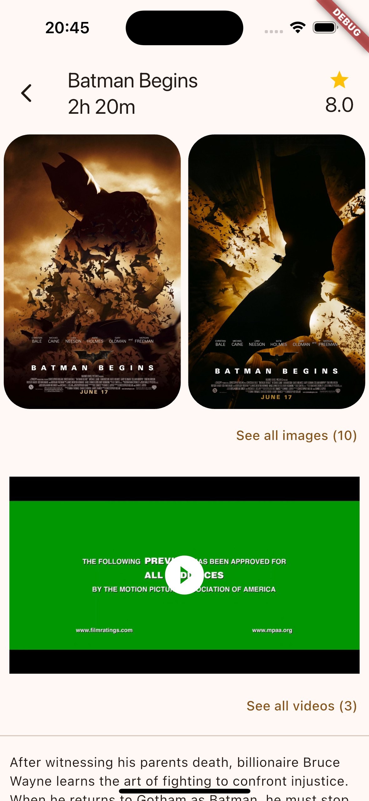
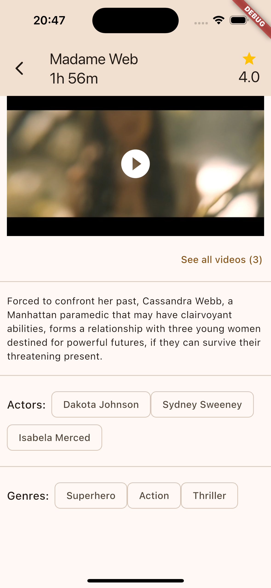
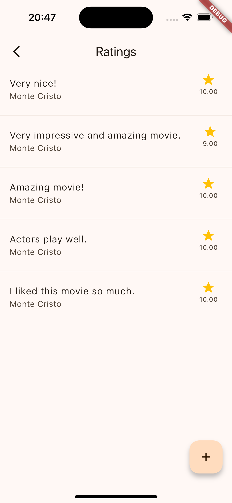
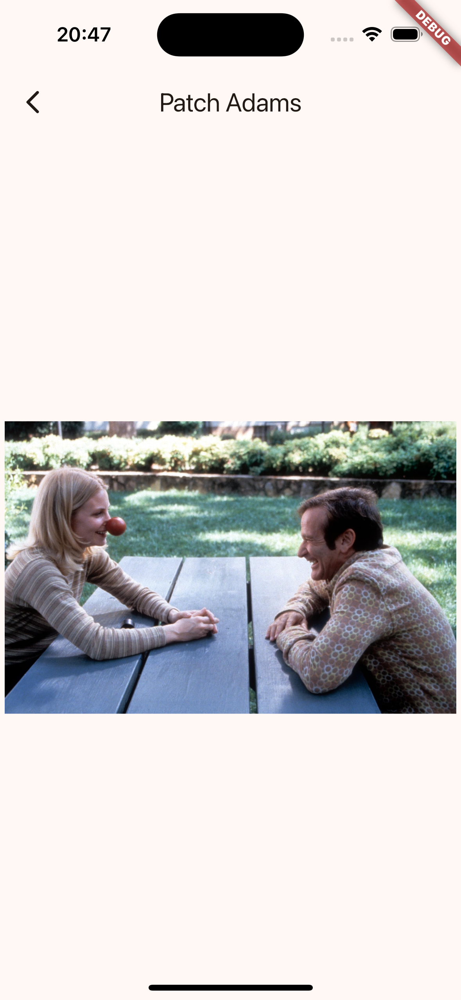

# Flutter Movie Rating Mobile App

Mobile application built with Flutter. Lists movies. Users can rate movies.
I built backend services with Golang. If you want to see it, I'll leave the link below.
<a href="https://github.com/burakiscoding/go-movie-rating">Go Movie Rating Backend</a>

## Tech Stack

- Flutter for mobile
- Golang for backend
- MySQL for database

## Screenshots

<p align="center">




</p>
<p align="center">




</p>

## Main features of the project

- Network layer with Dio
- Clean architecture(and ofc so many boilerplate code)
- State management with Bloc(safe emit method with mixins)
- Jwt auth using interceptors

## What could I have done better

- The data(models) returned from the backend is formatted for use on the mobile. So it wouldn't matter if I didn't create entities.
- I could build a single feature in detail. It would be better if I just focus on one feature like jwt authentication, fetching/sorting/searching movies. A simple app based on a single feature.

## Developer's note

I aimed to explain the structure of an application. That's why I didn't pay attention to the details of each feature. And I didn't aim to build good looking UI.

## How to install

Clone the repo
```
git clone https://github.com/burakiscoding/flutter_movie_rating.git
```
Move into the project directory
```
cd flutter_movie_rating
```
Get dependencies
```
flutter pub get
```
Run the app
```
flutter run
```